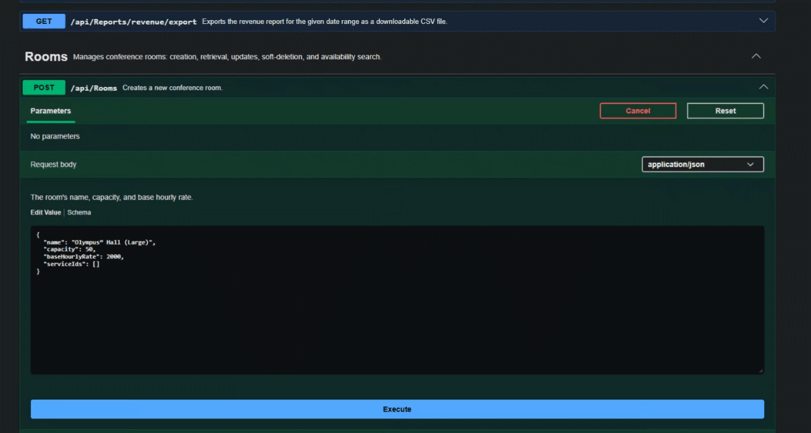
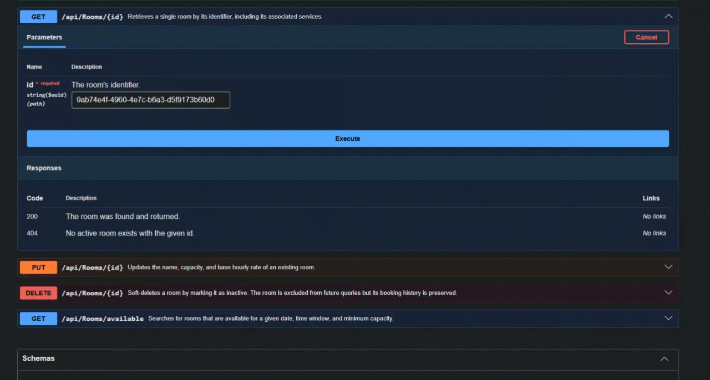
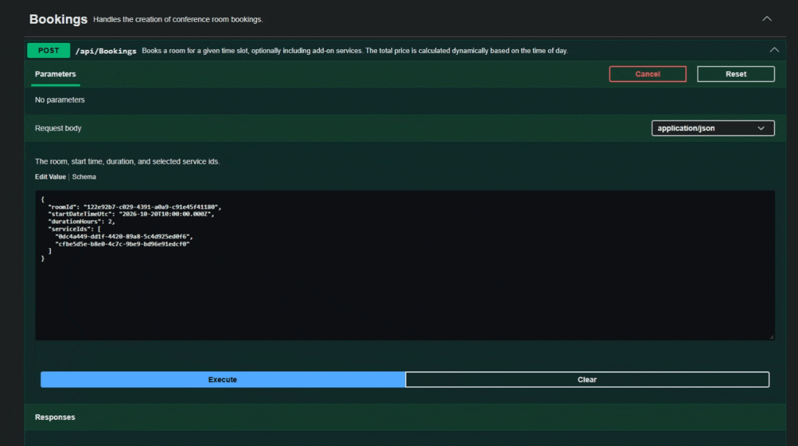
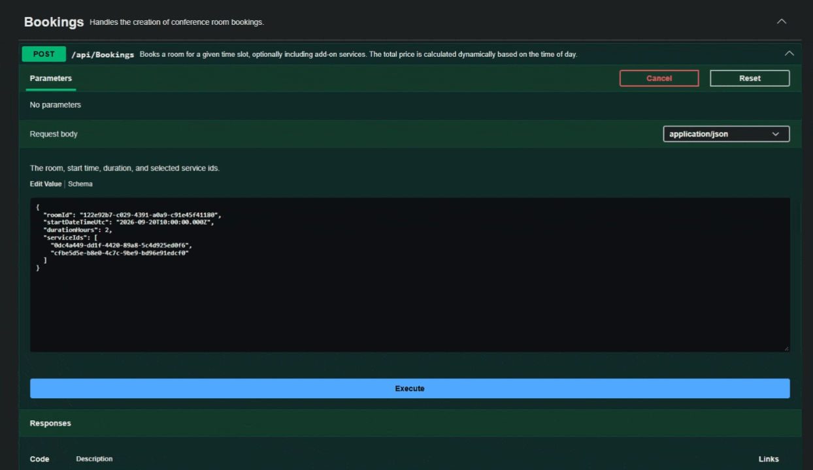
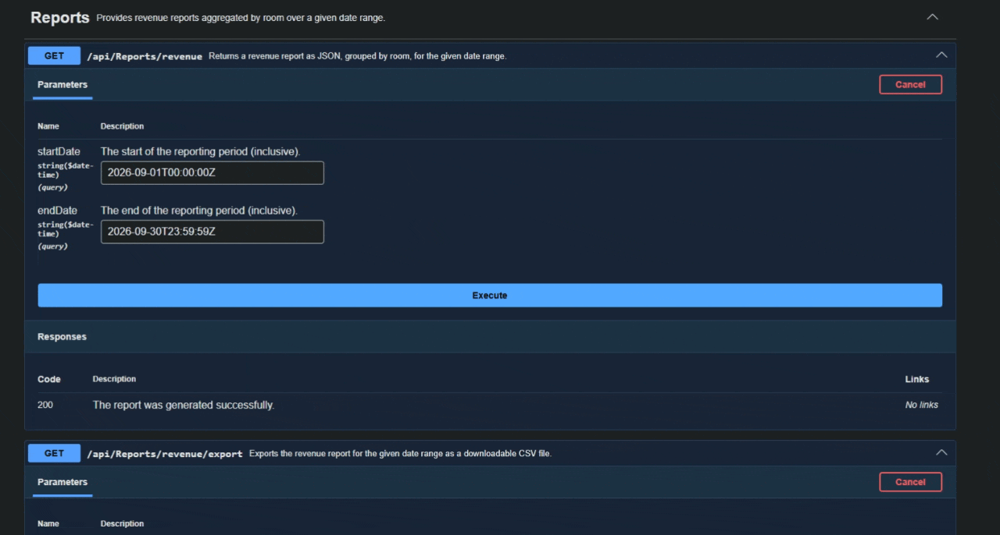

<div align="center">

# 🏢 Conference Room Booking API

**A REST API for managing conference room bookings** — search for available rooms, book them with optional add-on services, and manage rooms as an administrator.

Built with **.NET 10** · **Entity Framework Core** · **PostgreSQL**, following Clean Architecture principles.

</div>

---

## ✨ Features

| | |
|---|---|
| 🏢 | **Room management** — create, update, soft-delete conference rooms |
| 🔍 | **Availability search** — find rooms by date, time window, and required capacity |
| 📅 | **Bookings** — book a room with optional services, with dynamic pricing based on time of day |
| 🛡️ | **Overlap protection** — a PostgreSQL exclusion constraint prevents double-booking at the database level |
| 💰 | **Dynamic pricing** — hourly rate multipliers for discount/peak/standard time windows |
| 📊 | **Revenue reports** — per-room revenue breakdown, exportable as CSV |
| 📖 | **Swagger / OpenAPI** — interactive API documentation out of the box |

## 🏗️ Architecture

The solution follows a Clean Architecture layout, with dependencies pointing inward:

```
src/
├── ConferenceBooking.Domain          # Entities, invariants, no external dependencies
├── ConferenceBooking.Application     # Use cases, interfaces, specifications, DTOs
├── ConferenceBooking.Infrastructure  # EF Core, PostgreSQL, repositories, migrations
└── ConferenceBooking.Api             # Controllers, DI composition, Swagger

tests/
├── ConferenceBooking.UnitTests        # Domain + Application unit tests (xUnit, Moq, FluentAssertions)
└── ConferenceBooking.IntegrationTests # End-to-end tests against a real database
```

- **Domain** entities (`Room`, `Booking`, `Service`) encapsulate their own invariants (e.g. a `Booking` cannot be created in the past, or with `start >= end`).
- **Application** services (`RoomService`, `BookingService`, `ReportService`) contain the use-case logic and depend only on abstractions (`IUnitOfWork`, repository interfaces).
- Data access uses the **Repository + Unit of Work** pattern, combined with [Ardalis.Specification](https://github.com/ardalis/Specification) for composable, reusable queries (e.g. `RoomByIdWithServicesSpec`, `AvailableRoomsSpec`).
- **Infrastructure** is the only layer that knows about EF Core / Npgsql; database-specific errors (like overlap-constraint violations) are translated into domain-friendly exceptions before crossing into the Application layer.

## 🛠️ Tech Stack

| Component | Technology |
|---|---|
| Runtime | .NET 10 |
| Database | PostgreSQL |
| ORM | Entity Framework Core (Npgsql provider) |
| Query specifications | Ardalis.Specification |
| API docs | Swashbuckle (Swagger UI) |
| Testing | xUnit, Moq, FluentAssertions |

## ✅ Prerequisites

- [.NET 10 SDK](https://dotnet.microsoft.com/download)
- [Docker](https://www.docker.com/) and Docker Compose
- The `dotnet-ef` global tool:
  ```bash
  dotnet tool install --global dotnet-ef
  ```

## 🚀 Getting Started

### 1. Clone the repository

```bash
git clone <repository-url>
cd conference-room-booking-api
```

### 2. Configure environment variables

Copy the example env file and fill in your own values:

```bash
cp .env.example .env
```

`.env` holds the PostgreSQL credentials used by `docker-compose.yml`:

```env
POSTGRES_USER=postgres
POSTGRES_PASSWORD=your_secure_password_here
POSTGRES_DB=conference_db
POSTGRES_PORT=5432
```

> ⚠️ `.env` is git-ignored and must never be committed. Only `.env.example` (with placeholder values) is tracked in the repository.

### 3. Start PostgreSQL via Docker Compose

```bash
docker compose up -d
```

This reads `.env` and starts a PostgreSQL container on the configured port (default `5432`).

### 4. Configure the API connection string

Make sure `src/ConferenceBooking.Api/appsettings.json` matches the values from your `.env` file:

```json
{
  "ConnectionStrings": {
    "DefaultConnection": "Host=localhost;Port=5432;Database=conference_db;Username=postgres;Password=your_secure_password_here"
  }
}
```

### 5. Apply database migrations

```bash
dotnet ef database update --project src/ConferenceBooking.Infrastructure --startup-project src/ConferenceBooking.Api
```

### 6. Run the API

```bash
dotnet run --project src/ConferenceBooking.Api
```

In the **Development** environment, the app automatically applies pending migrations and seeds sample data (rooms, services) on startup.

The API will be available at:

| | |
|---|---|
| HTTP | `http://localhost:5292` |
| HTTPS | `https://localhost:7090` |
| Swagger UI | `http://localhost:5292/swagger` |

> 💡 If you haven't trusted the local HTTPS dev certificate yet, run `dotnet dev-certs https --trust`, or use the HTTP URL during local development.

## 🧪 Running Tests

```bash
# All tests
dotnet test

# Unit tests only
dotnet test tests/ConferenceBooking.UnitTests
```

## 📚 API Overview

### Rooms

| Method | Endpoint | Description |
|---|---|---|
| `POST` | `/api/Rooms` | Create a new room |
| `GET` | `/api/Rooms/{id}` | Get a room by id (with its services) |
| `PUT` | `/api/Rooms/{id}` | Update room details |
| `DELETE` | `/api/Rooms/{id}` | Soft-delete a room |
| `GET` | `/api/Rooms/available` | Search available rooms by date, time range, and capacity |

### Bookings

| Method | Endpoint | Description |
|---|---|---|
| `POST` | `/api/Bookings` | Book a room for a time slot, with optional services |

### Reports

| Method | Endpoint | Description |
|---|---|---|
| `GET` | `/api/Reports/revenue` | Revenue report grouped by room, as JSON |
| `GET` | `/api/Reports/revenue/export` | Same report, exported as a downloadable CSV file |

Full request/response schemas are available in Swagger UI once the app is running.

<details>
<summary><strong>Example: search for available rooms</strong></summary>

```
GET /api/Rooms/available?Date=2026-09-20&StartTime=10:00:00&EndTime=12:00:00&Capacity=10
```

</details>

<details>
<summary><strong>Example: create a booking</strong></summary>

```json
POST /api/Bookings
{
  "roomId": "122e92b7-c029-4391-a0a9-c91e45f41180",
  "startDateTimeUtc": "2026-09-20T10:00:00Z",
  "durationHours": 2,
  "serviceIds": []
}
```

</details>

## 💰 Pricing Logic

Room cost is calculated per hour segment based on the local (Kyiv) time of day:

| Time window (local) | Multiplier |
|---|:---:|
| 06:00 – 09:00 | ×0.9 (discount) |
| 09:00 – 12:00 | ×1.0 (standard) |
| 12:00 – 14:00 | ×1.15 (peak surcharge) |
| 14:00 – 18:00 | ×1.0 (standard) |
| 18:00 – 23:00 | ×0.8 (evening discount) |
| 23:00 – 06:00 | ×1.0 (default) |

A booking that spans multiple windows is billed proportionally per segment. See `PriceCalculator.cs` for the implementation.

## 🔒 Double-Booking Prevention

Overlapping bookings for the same room are rejected at two levels:

1. **Database** — a PostgreSQL exclusion constraint (using the `btree_gist` extension) guarantees no two bookings for the same room can have overlapping time ranges, even under concurrent requests.
2. **API** — a constraint violation is caught and translated into a `409 Conflict` response with a clear error message.

## 🎥 API Demonstration

Examples of the key functionality in action via the Swagger UI.

### Room Management (`RoomsController`)

| | |
|---|---|
| **Creating a new room** |  |
| **Getting a room by ID** |  |
| **Updating room data** |  |
| **Deleting a room (soft delete)** |  |
| **Finding available rooms for a specified time** |  |

### Bookings (`BookingsController`)

| | |
|---|---|
| **Successful room booking with price calculation** |  |
| **Double booking protection (409 Conflict)** |  |

### Analytics (`ReportsController`)

| | |
|---|---|
| **Generating a room revenue report** |  |

## 📌 Project Status

This is a work-in-progress learning/test project. Contributions and suggestions are welcome via issues or pull requests.